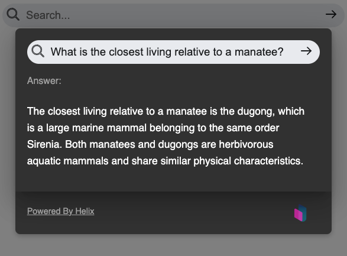

# @helixml/chat-widget


The `@helixml/chat-widget` is a UI component that makes it easy to expose large language models behind common APIs (e.g. OpenAI API). It is packaged both as a react component and a browser-side library.



## Browser Usage

The `@helixml/chat-embed` library is a standalone wrapper around our [React library](#react-component-usage) that can easily be embedded onto any page with a `<script>` tag.

It will bundle using the [IIFE](https://en.wikipedia.org/wiki/Immediately_invoked_function_expression) format which means that we can put this script tag on any page that uses any JS library - it is totally self contained and non combative with other versions of React or other libraries the user might have installed.

### Install

Load the library from a CDN and then you can call the global `ChatWidget` to render it somewhere in your application.

You can find the full list of versions on [jsdelivr](https://www.jsdelivr.com/package/npm/@helixml/chat-embed). You can use https://www.srihash.org/ to calculate the integrity hash.

The arguments you pass to the `ChatWidget` function are the same as the properties passed to the [React library](#props).

```html
<script src="https://cdn.jsdelivr.net/npm/@helixml/chat-embed@VERSION" integrity="..." crossorigin="anonymous"></script>
<script>
  ChatWidget({
      url: 'https://api.openai.com/v1/chat/completions',
      model: 'gpt-3.5-turbo',
      bearerToken: 'YOUR_API_KEY',
  })
</script>
```

## React Component Usage

The `@helixml/chat-widget` is a highly customizable React component designed to provide interactive chat functionality within your application. It features a minimalist design that opens a modal window upon interaction, where users can submit questions and receive answers from a specified openAI compatible endpoint.

### Installation

To use the `@helixml/chat-widget` in your project, install it via npm:

```bash
npm install @helixml/chat-widget
```

or using yarn:

```bash
yarn add @helixml/chat-widget
```

### Usage

Import and use the `Widget` component in your React application:

```jsx
import React from 'react';
import Widget from '@helixml/chat-widget';

function App() {
  return (
    <div className="App">
      <Widget
        url="https://myopenaiendpoint.com"
        model="my_model_name"
        windowTheme={{ /* Optional window theme overrides */ }}
        searchTheme={{ /* Optional search theme overrides */ }}
      />
    </div>
  );
}

export default App;
```

#### Props

- `url`: String. The endpoint URL for the remote API from which the answers will be fetched.
- `model`: String. Identifier for the specific model to be queried at the remote API.
- `bearerToken`: (Optional) String. Bearer token for authentication with the remote API, if required.
- `title`: (Optional) String. Title text for the chat window.
- `logo`: (Optional) String. URL of the logo image to display in the header.
- `placeholder`: (Optional) String. Placeholder text for the search input.
- `windowTheme`: (Optional) Object. Theme customization for the window component. See the Theme Customization section below for details.
- `searchTheme`: (Optional) Object. Theme customization for the search input. See the Theme Customization section below for details.

### Theme Customization

Customize the appearance of the chat widget and its components using the `windowTheme` and `searchTheme` props. Each theme object allows you to override default styles to match your application's design.

#### Window Theme Options

- `logoWidth`: Width of the logo inside the header.
- `backdropColor`: Color of the modal backdrop.
- `backgroundColor`: Background color of the window.
- `width`: Width of the window.
- `verticalMargin`: Vertical margin of the window.
- `borderRadius`: Border radius of the window.
- `shadow`: Box shadow for the window.
- `fontFamily`: Font family for text inside the window.
- `headerTextColor`: Text color for the header.
- `headerFontSize`: Font size for the header text.
- `headerPadding`: Padding inside the header.
- `errorTextColor`: Text color for error messages.
- `errorFontSize`: Font size for error messages.
- `contentBoxShadow`: Box shadow for the content area inside the window.
- `contentPadding`: Padding inside the content area.
- `replyTextColor`: Text color for the reply messages.
- `replyFontSize`: Font size for the reply messages.
- `subtitleTextColor`: Text color for subtitles.
- `subtitleFontSize`: Font size for subtitles.
- `footerPadding`: Padding inside the footer.
- `closeButtonBorderRadius`: Border radius of the close button.
- `closeButtonColor`: Color of the close button.
- `closeButtonPadding`: Padding of the close button.
- `closeButtonFontSize`: Font size of the close button text.

#### Search Theme Options

- `borderColor`: Border color of the search input.
- `backgroundColor`: Background color of the search input.
- `hoverBorderColor`: Border color of the search input on hover.
- `borderRadius`: Border radius of the search input.
- `iconPadding`: Padding around the search icon.
- `iconColor`: Color of the search icon.
- `textPadding`: Padding inside the search input for text.
- `textSize`: Font size of the text inside the search input.
- `fontFamily`: Font family of the search input text.

## License

This project is licensed under the MIT License - see the LICENSE file for details.
