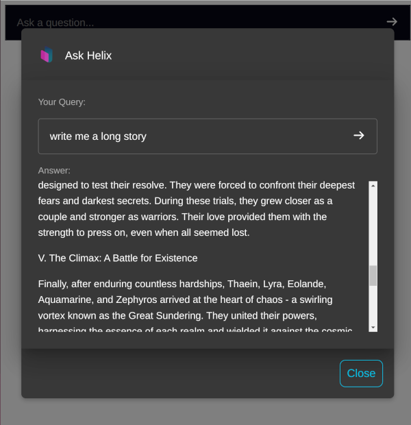

# @helixml/chat-embed


The `@helixml/chat-embed` library is a standalone wrapper around our [chat-widget](https://github.com/helixml/chat-widget) library that can easily be embedded onto any page with a `<script>` tag.

It will bundle using the [IIFE](https://en.wikipedia.org/wiki/Immediately_invoked_function_expression) format which means that we can put this script tag on any page that uses any JS library - it is totally self contained and non combative with other versions of React or other libraries the user might have installed.

## Usage

Load the library from a CDN and then you can call the global `ChatWidget` to render it somewhere in your application.

The arguments you pass to the `ChatWidget` function are the same as the properties passed to the [chat-widget](https://github.com/helixml/chat-widget) library and so you can refer to it's documentation.

```html
<script
  src="https://cdn.jsdelivr.net/npm/@helixml/chat-embed"
  integrity="sha256-4zSVtrMXR/BJuUbZxuWo3+MrS/el0lOHBi3DCamRq88="
  crossorigin="anonymous"
></script>
<script>
  ChatWidget({
    apiURL: 'https://searchbots.com/api/v1/chat',
    token: 'XXX',
    model: 'my-smart-model',
  })
</script>
```



## License

This project is licensed under the MIT License - see the LICENSE file for details.
